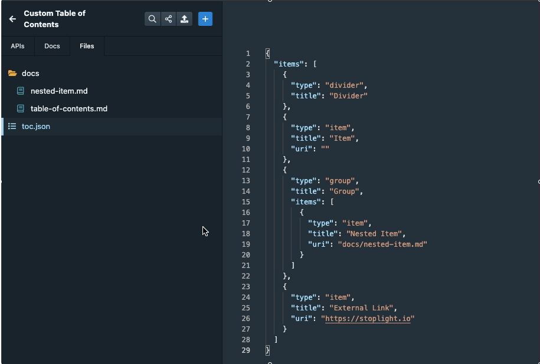
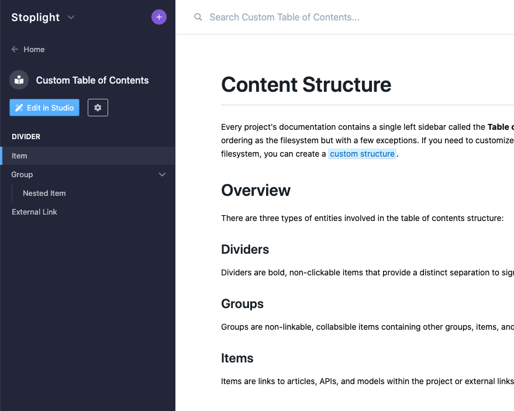

# Content Structure

Every project's documentation contains a single left sidebar called the **Table of Contents** (or TOC). The [default structure](#default-structure) loosely follows the filesystem, with a few exceptions for APIs and models. If you want to customize how your files are organized, you can create a [custom structure](#custom-structure).


## Overview

There are three types of entities in the table of contents structure:

### Dividers

Dividers are bold, non-clickable items that provide a distinct separation to signify the start of a section within the content structure.

### Groups

Groups are non-linkable, collabsible items containing other groups, items, and dividers that all deal with the same subject.

### Items

Items are links to articles, APIs, and models within the project or external links to content outside of the documentation.

## Default Structure

The default structure is ordered based on a few factors, such as the file type, but primarily follows the same alphanumeric ordering as the filesystem.

### Articles

Markdown articles come first in the table of contents and are ordered alphanumerically by their file path. The first directory is represented as a [divider](#dividers) and any directories after appear as [groups](#groups). There's one exception, if a "docs" folder exists it is flattened and not represented in the table of contents.

### APIs

Next in the list below articles are your APIs. Each API's title will be represented as a [divider](#dividers) followed by an item titled "Overview". The overview item will contain the API's description, contact, licensing, servers and global security. 

All of the API endpoints and models will be nested inside [groups](#groups) titled after their first tag. Any without tags will be placed into a group titled "other". 

### Models

Finally at the bottom of the table of contents are the JSON Schema files, sorted alphabetically under a [divider](#dividers) titled "Models".

## Custom Structure

<!-- 
theme: warning
-->

> This feature is in private beta. If you would like to join the beta, please [submit a request](https://roadmap.stoplight.io/c/59-completely-custom-ordering-of-your-docs-sidebar) on our public roadmap.

If you need more control over the ordering of your project's content structure, you can create a custom table of contents. To get started, create a `toc.json` file in the root of your project's directory.

### Rules

The root of the `toc.json` file will start with an empty `items` array where you will define your content structure using [dividers](#dividers), [groups](#groups) and [items](#items).

<!-- title: toc.json -->
```json
{
  "items": []
}
```

Each entity will have a `type` and a `title` property. Items will have an additional `uri` property that either points to a file somewhere within the project or an external link to another website. Groups will have an `items` property allowing you to futher nest items, dividers and groups.

> **TIP**: The easiest way to get a file's URI in Studio is to click the `...` button next to the file, click the "copy path" menu item then paste the contents.



### Example

Here's a very basic example to demonstrate the format of the `toc.json` file. 

<!--
title: toc.json
-->
```json
{
  "items": [
    {
      "type": "divider",
      "title": "Divider"
    },
    {
      "type": "item",
      "title": "Item",
      "uri": "docs/table-of-contents.md"
    },
    {
      "type": "group",
      "title": "Group",
      "items": [
        {
          "type": "item",
          "title": "Nested Item",
          "uri": "docs/nested-item.md"
        }
      ]
    },
    {
      "type": "item",
      "title": "External Link",
      "uri": "https://stoplight.io"
    }
  ]
}
```

The above `toc.json` file will display the following structure in the docs sidebar.




### Limitations

There are a few known limitations with the custom table of contents that we are working to address.

1. **An item's `uri` property cannot point to contents within a file.** This means you cannot create an [item](#items) for endpoints or models. Items pointing to API files will follow the [default structure](#default-structure) for grouping their inner contents.
2. **Studio does not validate the `toc.json` file format.** Since the TOC must be written by hand means it can be easy to break the formatting, so please make sure to follow the [rules of the structure](#rules). We are planning a drag and drop editor within Studio to make it easier to edit the TOC.
3. **Renaming or moving a file does not automatically update the `toc.json` file.** You'll need to remember to update your TOC whenever a file is renamed or your docs sidebar will contain broken links.
4. **The table of contents does not allow configuring the docs routing structure.** Routing will still reflect the filesystem meaning the docs URLs to a file's docs will show the file path in the URL.
5. **Studio does not allow previewing the `toc.json` file.** We are working to add previewing in the short term and a drag and drop editor in the mid term.

If you find any more limitations or would like to make a suggestion, please submit your idea on our [public roadmap](https://roadmap.stoplight.io/tabs/7-under-consideration/submit-idea)!

